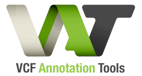

VAtools (VCF Annotation Tools) is a python package for easy manipulation of genomic data stored in the common VCF format

**[vcf-readcount-annotator](https://vatools.readthedocs.io/en/latest/vcf_readcount_annotator.html)**

A tool that will add the data from bam-readcount files to the VCF sample column. Writes depth, allele counts, and VAFs; optionally also writes detailed per-read quality metrics (mapping quality, base quality, strand counts, and more) as additional FORMAT fields.

**[vcf-expression-annotator](https://vatools.readthedocs.io/en/latest/vcf_expression_annotator.html)**

A tool that will add the data from several expression tools’ output files to the VCF FORMAT column, on a per-sample basis. Directly supports outputs from StringTie, Kallisto, Cufflinks, or custom formats that you define.

**[vcf-info-annotator](https://vatools.readthedocs.io/en/latest/vcf_info_annotator.html)**

A general-purpose tool that will add data from a tab-delimited file into VCF INFO fields. Supports mapping multiple TSV columns to multiple INFO fields in a single pass.

**[vcf-genotype-annotator](https://vatools.readthedocs.io/en/latest/vcf_genotype_annotator.html)**

A tool to add a new sample to an existing VCF file or fill in the GT field for an existing sample in a VCF. Fills a need for genotype manipulation in VCFs that don’t contain one, which can cause errors in downstream tools.

**[vep-annotation-reporter](https://vatools.readthedocs.io/en/latest/vep_annotation_reporter.html)**

VEP annotations in a VCF are condensed into a CSQ field that is meant to be machine-readable, and can be difficult for humans to read and interpret. The VEP Annotation Reporter extracts it into a human-readable report.

**[ref-transcript-mismatch-reporter](https://vatools.readthedocs.io/en/latest/ref_transcript_mismatch_reporter.html)**

A tool to identify problematic variants in a VCF where the reference genome used to align and call variants doesn’t match the Ensembl reference transcript used by VEP for variant consequence annotations.

**[transform-split-values](https://vatools.readthedocs.io/en/latest/transform_split_values.html)**

A tool that extracts and manipulates values from existing sample fields and outputs the results to a TSV file.

## Documentation

Please see [vatools.org](http://vatools.org) for the full documentation.

## Install

Install with pip
`pip install vatools`

Or with bioconda
`conda install -c bioconda -c conda-forge vatools`

## Container images

VAtools is available as a Docker Image at <a href="https://hub.docker.com/r/griffithlab/vatools/">DockerHub griffithlab/vatools</a>.

## Stable release with DOI

